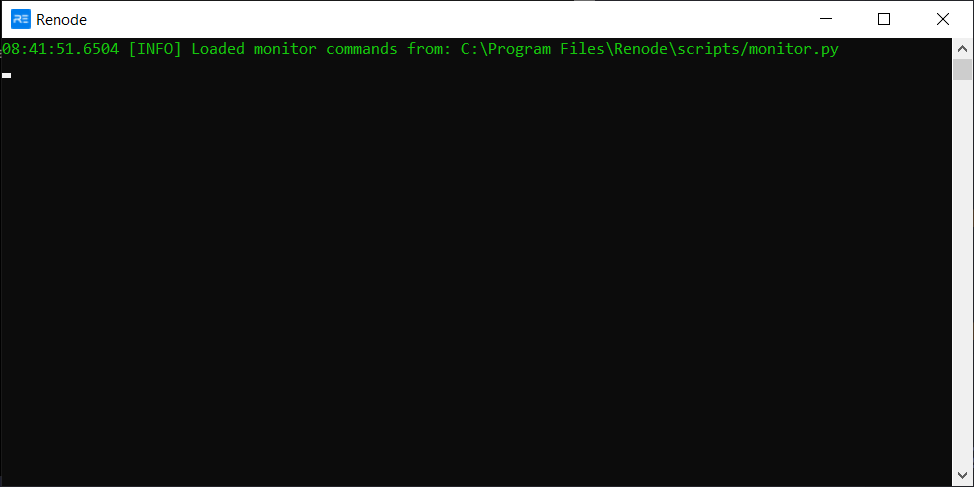

# How to use renode

## What is renode

Renode is an emulator allowing you to test code written for microcontrollers on your PC.

## Installation

For Windows:  go to [https://github.com/renode/renode/releases](https://github.com/renode/renode/releases) and download the latest version of the .msi installer.
As of the time of writing this tutorial, the current version of renode is Renode 1.13.2

## Basic instructions

When launching renode for the first time, you are greeted with two windows: the **prompt** in which you can input commands and the **log window** in which you will see what your program is doing or not doing.


The prompt



The log window


> **Warning**
> 
> Renode does not come with support for keyboards layouts other than QWERTY by default, you can add the layout via the Windows settings. You can also copy / paste commands from the tutorial into the prompt, you have to use `Ctrl + Shift + C` to copy and `Ctrl + Shift + V` to paste

Renode uses the concept of *machines*, which is the component on which the code is executed. To create a new machine to test some code, type `mach create` in the **prompt**. This will create a machine named ``machine-0``, to specify a name to your machine, simply add the name after  `create` : `mach create "stm32"`  will create a machine named `stm32`.

You will then need to load the specific hardware configuration of the board and µc that you want to simulate. This tutorial uses the stm32f4 discovery family of boards which is officially supported by renode. To set up a machine to use a specific architecture, type `machine LoadPlatformDescription <Path/to/the/decription/file>` here we type 
```
machineLoadPlatformDescription @platforms/boards/stm32f4_discovery.repl
```

Platform files always have the `.repl` extension as in renode platform.

> **Note**
> 
> The `@` in the above command is a C# way of telling the interpreter that the String that follows should be interpreted as a path. The `@` also provides a shortcut to the renode installation directory (where all the platform files are located) and to the directory in which renode was started. You can also use HTTP paths, absolute paths, and network paths.

At the moment of writing, the code generated by ST's CubeMx will hang when accessing some registers on renode; to remedy to this problem, two *tags* are needed:
```
sysbus Tag <0x40023C00, 0x40023C07> "FLASH:ACR" 0x5
sysbus Tag <0x50000010, 0x5000003f> "USB:RESET" 0x80000000
```
These *tags* will make sure that an access to the register `FLASH:ACR` will always return `0x5` and that an access to `USB:RESET` will always return `0x80000000`

You then need to "flash" the machine, which is done using the command `sysbus LoadELF <Path/To/Binary>`

Once the binary is loaded, start the machine with `start` or `s`.
To stop the machine, type `pause` or `p`.

If you want to restore renode to its original state without restarting it, type `Clear`.

> **Note**
> 
> Renode doesn't allow you to reset the execution of the program with a simple command. To do that you have to pause the machine and reload the ELF binary.
> This is best done with a macro that will be covered in the next section 

## Using a script to make things faster

Renode commands can be used in scripts to make sure that no configuration command is forgotten. Scripts are files with a `.resc` extension as in renode script.

Inside a script, you can use every command that you can type in the prompt, you can also use variables, comments and create macros.

We can create our first script by putting all the commands from the previous sections in a resc file.

```
# This is a comment

# Path to the binary of your application CHANGE THE PATH!
$bin?=@Path/to/the/binary

# Create the machine with the right platform
mach create "demo"
machine LoadPlatformDescription @platforms/boards/stm32f4_discovery.repl

# fix for the stm32f4's problem with accessing the ACR register and the USB register
sysbus Tag <0x40023C00, 0x40023C07> "FLASH:ACR" 0x5
sysbus Tag <0x50000010, 0x5000003f> "USB:RESET" 0x80000000

# small script to reset the machine
macro reset
"""
    # load the binary
    sysbus LoadELF $bin
"""

runMacro $reset

echo "Script loaded. Now start with with the 'start' command."
echo ""

```

Once the file is saved you can execute it with the `include @Path/to/script.resc` command. You can then start the machine.

## Logging peripheral accesses

To make sure that the program is working as intended, we can enable log messages when a peripheral is accessed. In one of the firsts examples of the training, you are tasked with making a LED blink on the board.

From the board's [datasheet](https://www.st.com/resource/en/user_manual/um1974-stm32-nucleo144-boards-mb1137-stmicroelectronics.pdf), we can see that the LEDs are connected to the pins B0, B7 and B14.


If our program makes the LD1 LED blink every second, we need to spy on the GPIO Port B, this can be done with the following command : `sysbus LogPeripheralAccess gpioPortB`. This will print a log message every time our program accesses the memory region of the GPIO's registers.


Here we can see a read from the GPIO port's ODR (Output Data Register) telling us that PB0 is set, we then see a write to the BSSR (Bit Set/Reset Register) of value `0x10000` which will reset the output of PB0 to 0.
